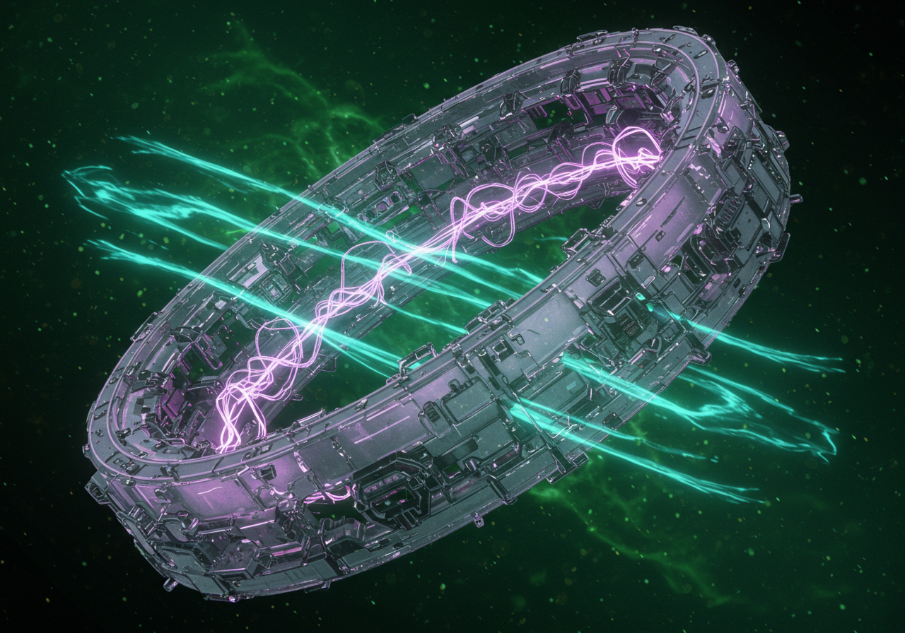

# SuperMoc Nexus - Struktura Obrazów

## Struktura katalogów
```
assets/
└── images/
    ├── products/      # Zdjęcia produktów
    ├── categories/    # Zdjęcia kategorii
    └── banners/       # Bannery i elementy główne
```

## 1. Zdjęcia Produktów (assets/images/products/)

### Generator Energii Psi
- chronos-mentis-elite-main.jpg     # Główne zdjęcie
- chronos-mentis-elite-1.jpg        # Miniatura 1
- chronos-mentis-elite-2.jpg        # Miniatura 2
- chronos-mentis-elite-3.jpg        # Miniatura 3

### Moduły Przyspieszenia
- velocitas-prime-main.jpg          # Główne zdjęcie
- velocitas-prime-1.jpg             # Miniatura 1
- velocitas-prime-2.jpg             # Miniatura 2
- velocitas-prime-3.jpg             # Miniatura 3

### Zestawy Inklinacji
- levitas-aether-main.jpg           # Główne zdjęcie
- levitas-aether-1.jpg              # Miniatura 1
- levitas-aether-2.jpg              # Miniatura 2
- levitas-aether-3.jpg              # Miniatura 3

### Bio-Regeneracja
- vitalis-phoenix-main.jpg          # Główne zdjęcie
- vitalis-phoenix-1.jpg             # Miniatura 1
- vitalis-phoenix-2.jpg             # Miniatura 2
- vitalis-phoenix-3.jpg             # Miniatura 3

## 2. Zdjęcia Kategorii (assets/images/categories/)

- category-psi.jpg                  # Generator Energii Psi
- category-speed.jpg                # Moduły Przyspieszenia
- category-gravity.jpg              # Zestawy Inklinacji
- category-bio.jpg                  # Systemy Bio-Regeneracji

## 3. Bannery (assets/images/banners/)

- hero-banner.jpg                   # Banner główny strony
- logo.png                          # Logo SuperMoc Nexus

## Zastosowanie w kodzie HTML

### Na stronie głównej:
```html
<!-- Logo -->


<!-- Banner główny -->


<!-- Kategorie -->


<!-- Produkty -->



```

### Na stronie produktu:
```html
<!-- Główne zdjęcie produktu -->


<!-- Miniatury -->


```

### Na stronie koszyka:
```html
<!-- Miniaturki produktów -->

```

## Wymiary obrazów

1. Produkty:
   - Główne zdjęcie: 800x800px
   - Miniatury: 200x200px

2. Kategorie:
   - Zdjęcia kategorii: 600x400px

3. Bannery:
   - Banner główny: 1920x600px
   - Logo: 200x60px

## Format i optymalizacja

- Wszystkie zdjęcia produktów i kategorii: JPEG z kompresją 85%
- Logo: PNG z przezroczystością
- Maksymalny rozmiar pliku:
  - Zdjęcia produktów: 300KB
  - Bannery: 500KB
  - Logo: 50KB